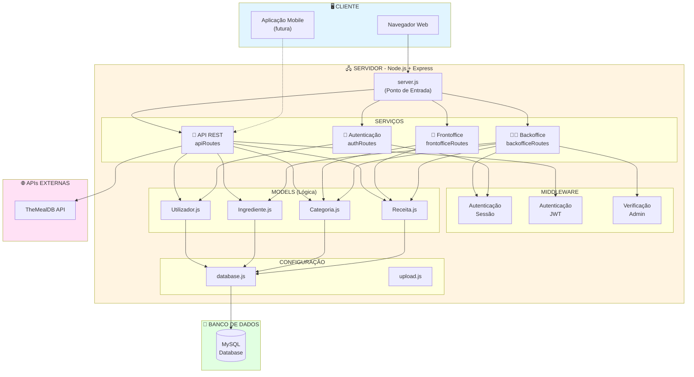
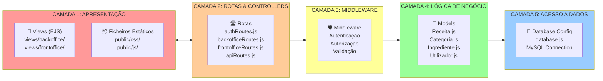
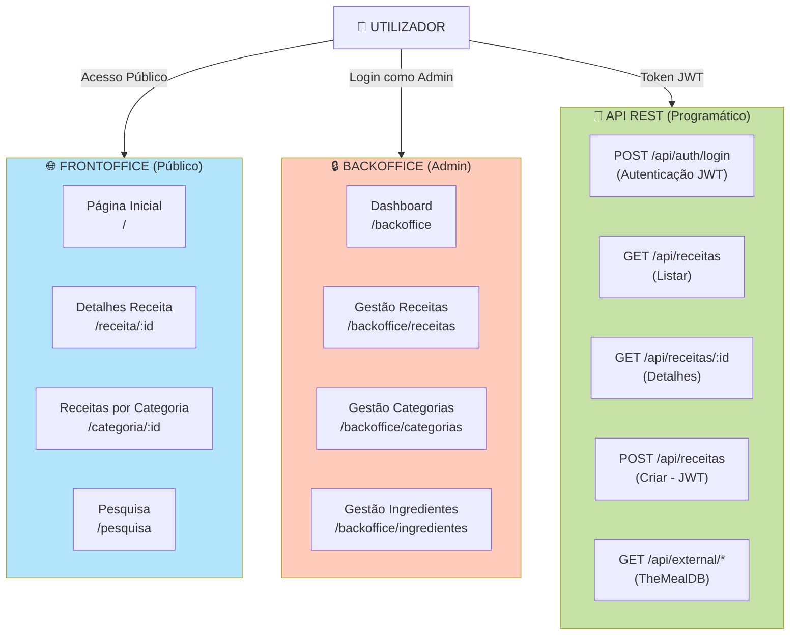
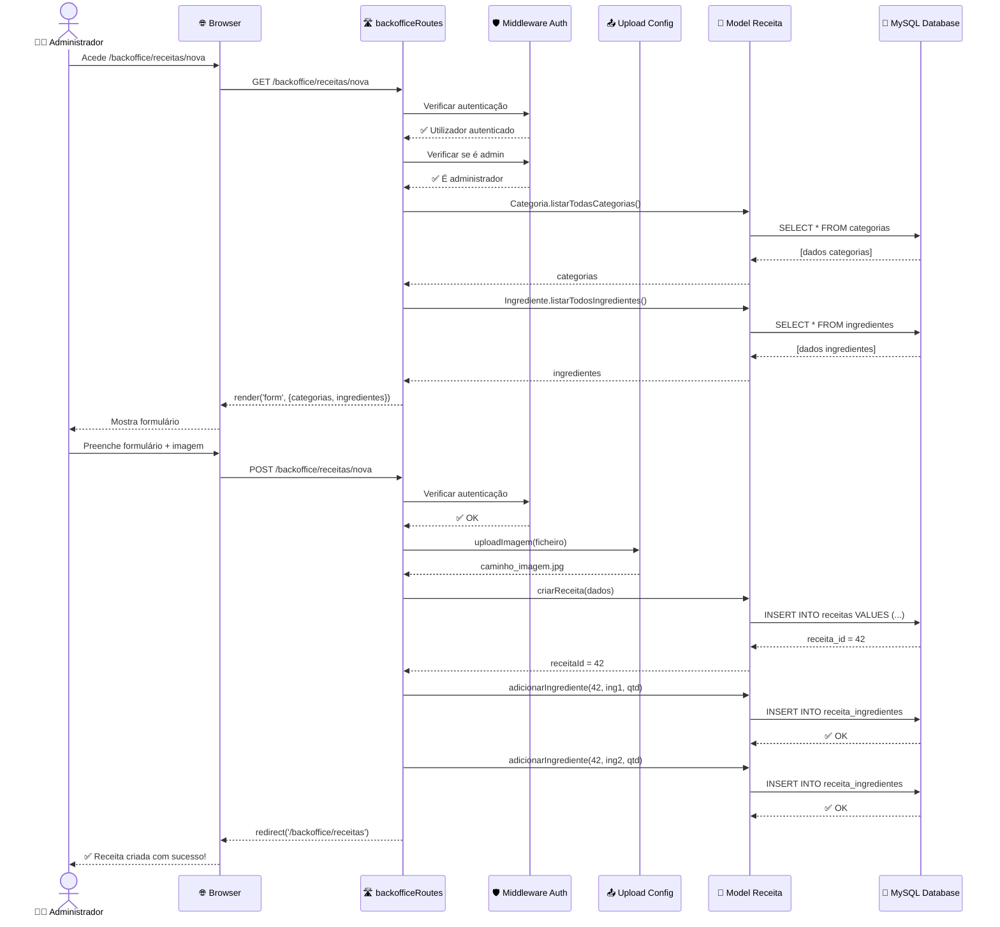
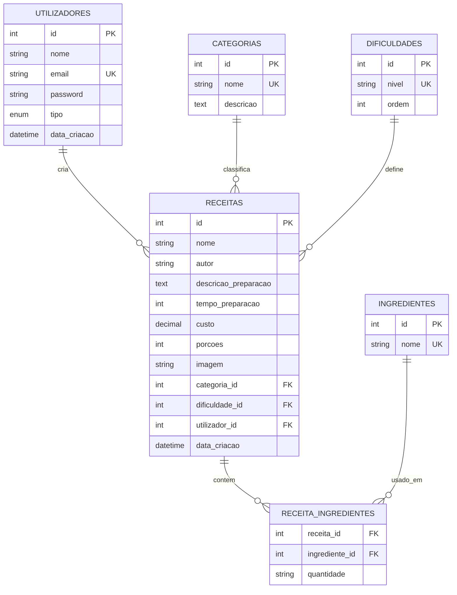
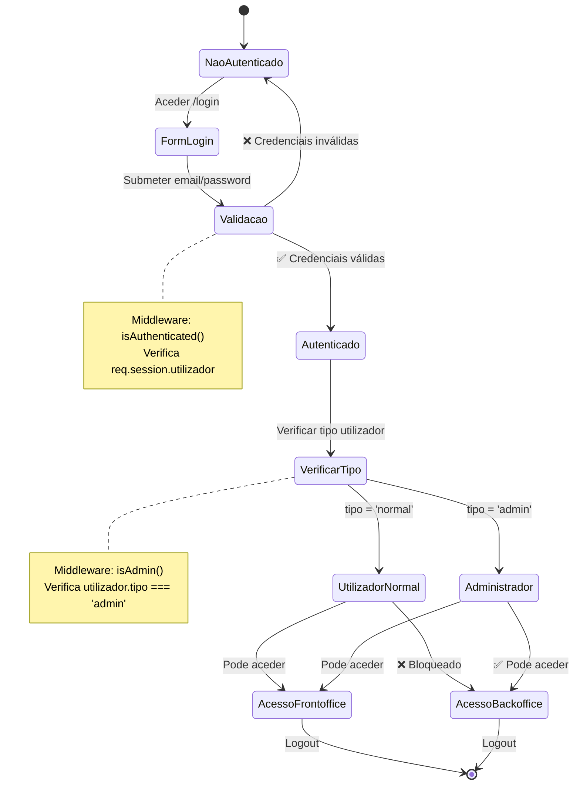
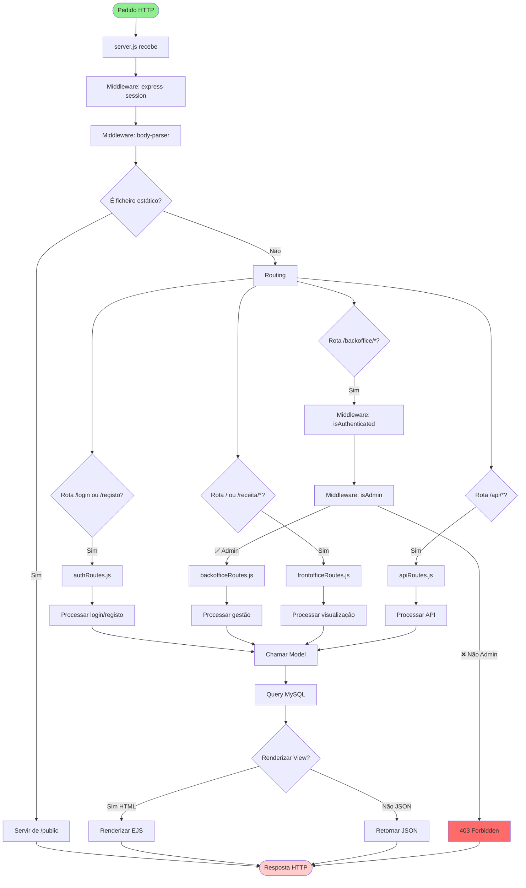
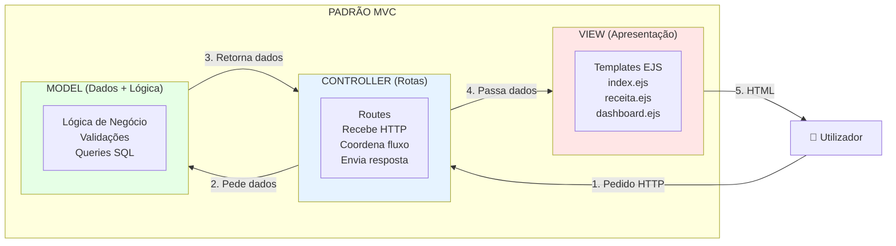
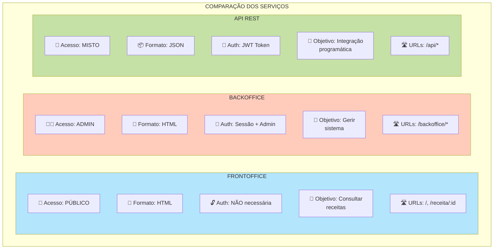
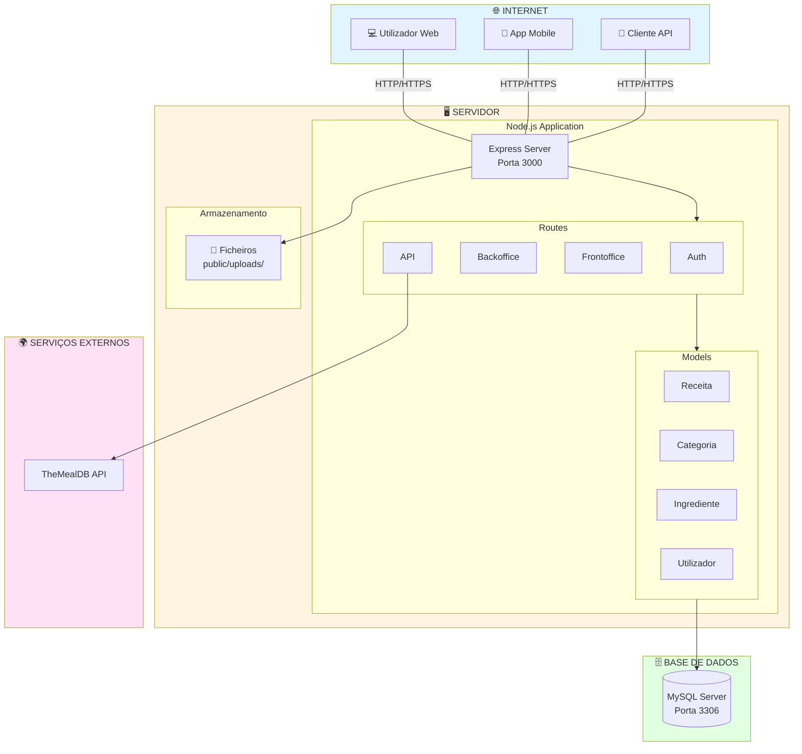

# 📊 Diagramas de Arquitetura - Gestão de Receitas

> **Como visualizar**: Este ficheiro contém diagramas em formato Mermaid. Pode visualizá-los em:
> - GitHub (renderiza automaticamente)
> - VS Code (com extensão Markdown Preview Mermaid)
> - [Mermaid Live Editor](https://mermaid.live/)

---

## 1. Arquitetura Geral do Sistema



---

## 2. Arquitetura em Camadas (Layered Architecture)



---

## 3. Os Três Serviços Principais



---

## 4. Fluxo de Dados: Exemplo Completo (Criar Receita)



---

## 5. Modelo de Dados (Entity Relationship)



---

## 6. Fluxo de Autenticação



---

## 7. Ciclo de Vida de um Pedido HTTP



---

## 8. Separação de Responsabilidades (MVC Pattern)



---

## 9. Comparação: Backoffice vs Frontoffice vs API



---

## 10. Diagrama de Deployment (Implantação)



---

## 📝 Notas de Utilização

### Como Ler os Diagramas:

1. **Cores**: Representam diferentes áreas do sistema
   - 🔵 Azul: Cliente/Interface
   - 🟡 Amarelo: Servidor/Lógica
   - 🟢 Verde: Base de Dados
   - 🔴 Rosa: Serviços Externos

2. **Setas**:
   - `-->`: Fluxo de dados/chamadas
   - `-.->`: Fluxo condicional/opcional
   - `==>`: Fluxo principal

3. **Símbolos**:
   - `[]`: Processos/Componentes
   - `()`: Início/Fim
   - `{}`: Decisões
   - `(())`: Base de Dados

### Ferramentas para Visualizar:

```bash
# Visual Studio Code
# Instalar extensão: Markdown Preview Mermaid Support

# Online
# https://mermaid.live/

# GitHub
# Renderiza automaticamente em ficheiros .md
```

---

*Diagramas criados para o projeto Gestão de Receitas - PIS 2025/2026*
